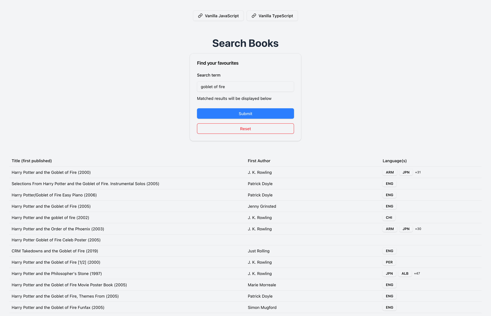

# Frontend live coding starter.

## Getting Started

First, run the development server:

```bash
npm install

npm run dev
# or
yarn dev
# or
pnpm dev
# or
bun dev
```

# Details

Visit: https://openlibrary.org/dev/docs/api/search

Read documentation for https://openlibrary.org/search.json?q={query}

Once ready, start the task

## Improvements

Below are some additions and changes I made, versus the original one I went with during the challenge on February 21st 2026.

### Highlights

The major one is that I've reimplemented the original solution with vanilla TypeScript, as well as a TypeScript + React Query combo.

By doing so, type safety was established, improving readability and maintainability. While React Query provides a robust data fetching solution and error handling that is battle tested and performant.

### Other minor tweaks

- Upgraded to Tailwind CSS v4
- Used Shadcn UI components
- Zod for schema validation
- Added a `prettier` config
- Structured the codebase with better organization and modularity (`components`, `constants`, `features`, `types`)

### Live site

This site has been deployed to [Cloudflare Pages](https://frontend-emma-challenge.pages.dev/)


